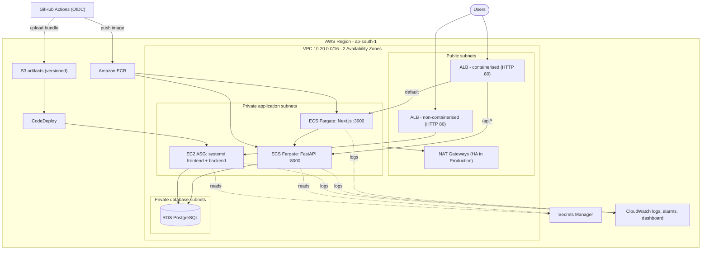

# Architecture diagram

GitHub renders the Mermaid block below automatically. Export it as PNG for the
submission with <https://mermaid.live> if an image file is required.

```mermaid
flowchart TB
  user([Users])

  subgraph AWS["AWS Region - ap-south-1"]
    subgraph VPC["VPC 10.20.0.0/16 - 2 Availability Zones"]
      subgraph PUB["Public subnets"]
        ALB1["ALB - containerised (HTTP 80)"]
        ALB2["ALB - non-containerised (HTTP 80)"]
        NAT["NAT Gateways (HA in Production)"]
      end
      subgraph APP["Private application subnets"]
        FE["ECS Fargate: Next.js :3000"]
        BE["ECS Fargate: FastAPI :8000"]
        EC2["EC2 ASG: systemd frontend + backend"]
      end
      subgraph DB["Private database subnets"]
        RDS[("RDS PostgreSQL")]
      end
    end
    ECR["Amazon ECR"]
    SM["Secrets Manager"]
    CW["CloudWatch logs, alarms, dashboard"]
    S3["S3 artifacts (versioned)"]
    CD["CodeDeploy"]
  end

  GH["GitHub Actions (OIDC)"]

  user --> ALB1
  user --> ALB2
  ALB1 -->|default| FE
  ALB1 -->|/api/*| BE
  ALB2 --> EC2
  FE --> BE
  BE --> RDS
  EC2 --> RDS
  BE -.reads.-> SM
  EC2 -.reads.-> SM
  GH -->|push image| ECR
  ECR --> FE
  ECR --> BE
  GH -->|upload bundle| S3
  S3 --> CD
  CD --> EC2
  FE -.logs.-> CW
  BE -.logs.-> CW
  EC2 -.logs.-> CW
  APP --> NAT
```

